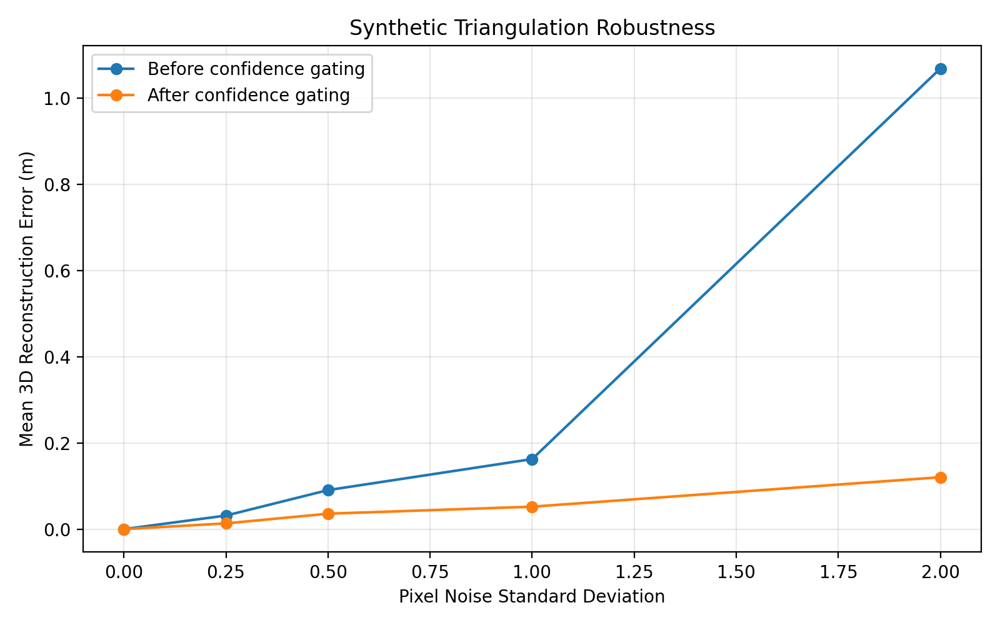
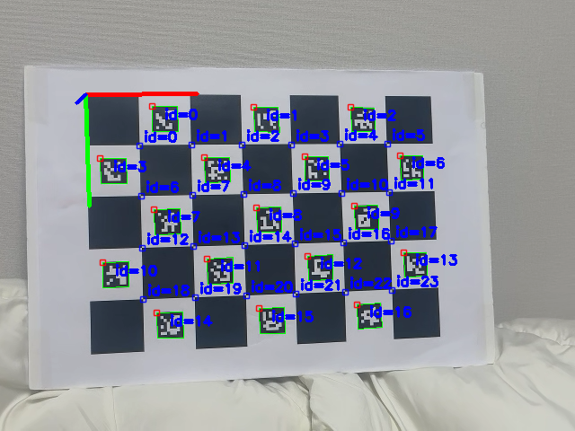
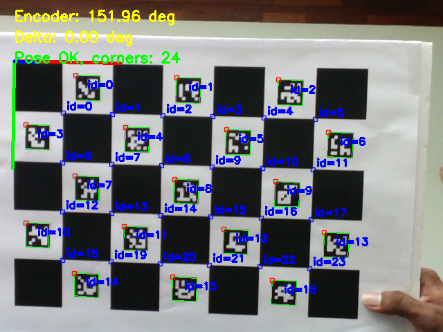

# Gretchen 3D Room Mapper

A computer vision and robotics project for **3D scene reconstruction and camera pose estimation** using the Gretchen humanoid robot.

Developed during the **Seoul National University International Summer Program (SNU ISP)**, the project combines camera calibration, ChArUco-based pose estimation, synthetic triangulation, and Dynamixel motor control to build the foundations of a robotic 3D mapping system.

## Overview

For a robot to reconstruct its surroundings in 3D, it must understand both **where its camera is positioned** and **where observed points lie in 3D space**.

This project implements several components of that pipeline:

1. Calibrate Gretchen's camera using a ChArUco calibration board.
2. Estimate the camera's 3D pose from detected ChArUco markers.
3. Collect pose-validation data while controlling the robot's pan mechanism.
4. Triangulate observations from multiple viewpoints into 3D coordinates.
5. Apply confidence checks to reject unreliable triangulation results.
6. Visualize reconstructed geometry and validate the pipeline with synthetic data.

## System Pipeline

```text
Gretchen Camera
      │
      ▼
Camera Calibration
      │
      ▼
ChArUco Detection
      │
      ▼
Camera Pose Estimation
      │
      ├──────────────► Pan / Dynamixel Measurements
      │
      ▼
Multi-View Observations
      │
      ▼
3D Triangulation
      │
      ▼
Confidence Gating
      │
      ▼
3D Reconstruction / Visualization
```

## Key Features

### Camera Calibration

Captures ChArUco calibration images and estimates camera intrinsic parameters and distortion coefficients using OpenCV.

Relevant files:

- `src/capture_charuco.py`
- `src/calibrate_camera.py`
- `src/detect_charuco.py`

### ChArUco Pose Estimation

Detects ChArUco markers and estimates the camera pose relative to a known calibration board.

The resulting rotation and translation information provides a reference for validating the robot camera's position in 3D space.

Relevant file:

- `src/estimate_charuco_pose.py`

### Pose Validation Dataset

A pose-validation pipeline collects synchronized camera observations and robot pan measurements for evaluating pose estimation.

The repository includes a dataset of captured validation images together with calibration parameters and pose results.

Relevant file:

- `src/collect_pose_validation.py`

### Synthetic 3D Triangulation

Implements a synthetic multi-view geometry pipeline for testing 3D reconstruction before relying entirely on physical robot measurements.

Components include:

- Camera projection model
- Multi-view triangulation
- Confidence gating
- Synthetic scene generation
- Reconstruction visualization
- Unit tests

Relevant files:

```text
src/geometry/camera_model.py
src/geometry/triangulation.py
src/geometry/confidence.py
src/synthetic_triangulation_test.py
src/visualize_synthetic.py
```
### Triangulation Robustness

Synthetic experiments evaluated how pixel noise affects 3D reconstruction accuracy. Confidence gating filters unreliable triangulations, substantially reducing reconstruction error under noisy observations.



### Dynamixel Motor Diagnostics

Includes utilities for communicating with and diagnosing the Gretchen robot's Dynamixel motors.

```text
src/ping_dynamixel.py
src/read_dynamixel_position.py
src/scan_dynamixel_ids.py
```

These tools support reading pan positions and validating robot-camera pose measurements.

## Tech Stack

- **Python**
- **OpenCV**
- **NumPy**
- **ChArUco / ArUco markers**
- **Dynamixel SDK**
- **Multi-view geometry**
- **3D triangulation**
- **Computer vision**

## Repository Structure

```text
gretchen-3d-room-mapper/
├── config/
├── data/
│   └── pose_validation/
│       ├── calibration/
│       ├── dataset/
│       ├── outputs/
│       └── test_images/
├── outputs/
├── src/
│   ├── geometry/
│   │   ├── camera_model.py
│   │   ├── confidence.py
│   │   └── triangulation.py
│   ├── calibrate_camera.py
│   ├── capture_charuco.py
│   ├── collect_pose_validation.py
│   ├── estimate_charuco_pose.py
│   └── ...
└── tests/
```

## Example Pose Estimation Result

Below is an example ChArUco-based pose estimation output from the validation pipeline:



The corresponding numerical pose result is stored in:

```text
data/pose_validation/outputs/charuco_pose_result.json

### Pose Validation Dataset Example

Example image captured during the pose-validation data collection process:



## What I Worked On

My contributions focused on the **camera pose-validation portion of the 3D mapping pipeline**, including:

- ChArUco-based camera pose estimation
- Camera calibration and image capture
- Pan pose-validation dataset collection
- Integration and debugging of Dynamixel motor measurements
- Hardware diagnostic utilities for the robot's pan/tilt system

The project also incorporates a synthetic triangulation module for testing the 3D reconstruction pipeline.

## Context

This project was developed as part of the **First Steps in Programming a Humanoid AI Robot** course during the **Seoul National University International Summer Program 2026**.

The work was collaborative, with development organized across feature branches and integrated through Git.

## Future Improvements

Potential extensions include:

- Complete automated pan/tilt scanning
- Real-time multi-view object triangulation
- Dense point-cloud generation
- Improved pose-confidence estimation
- Integration of object detection with reconstructed 3D coordinates
- Interactive visualization of the reconstructed environment

